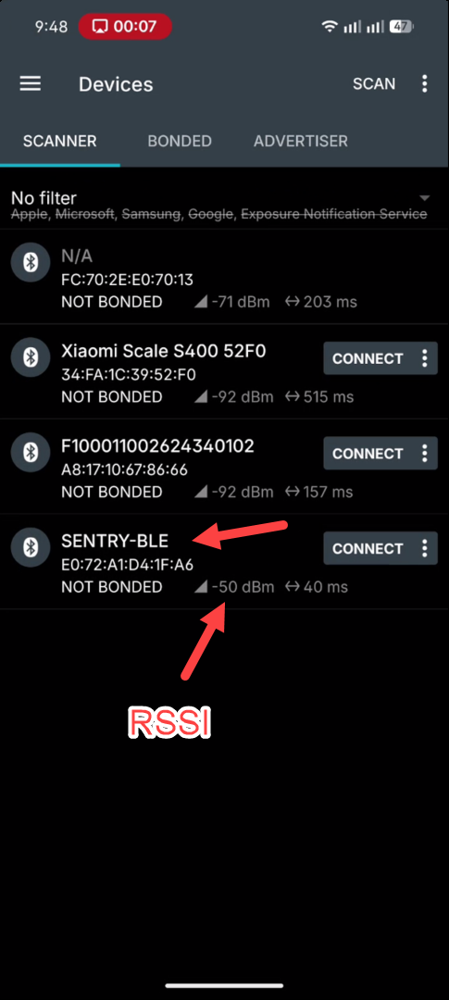
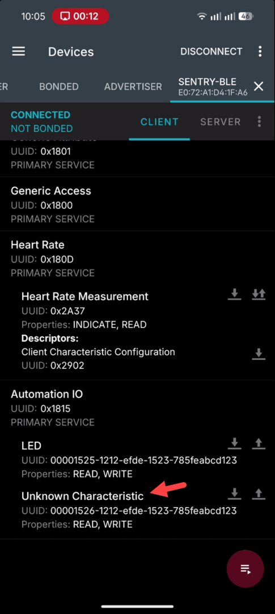
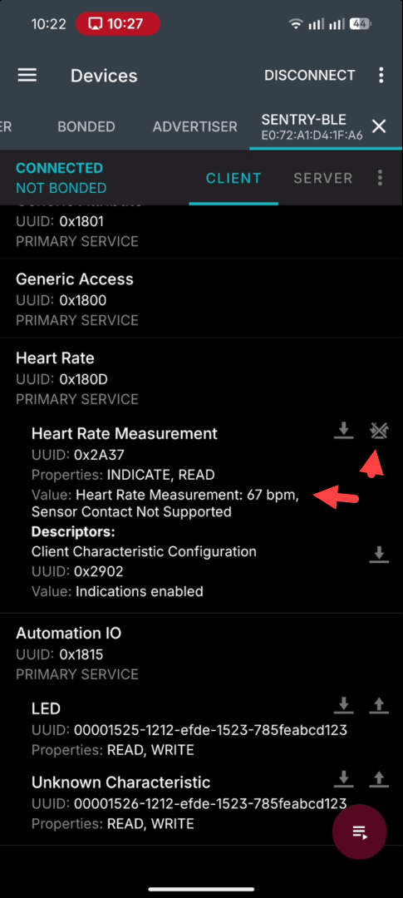
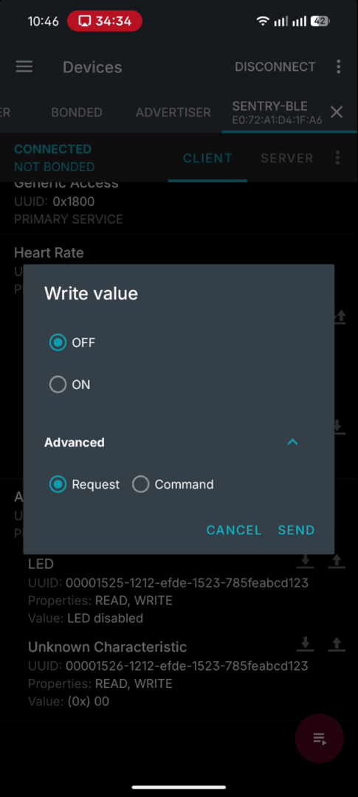
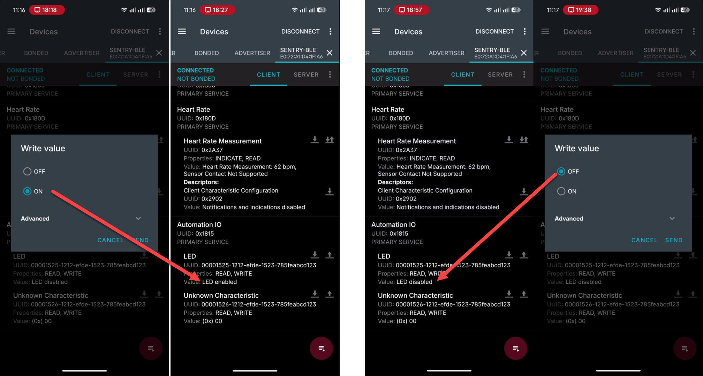
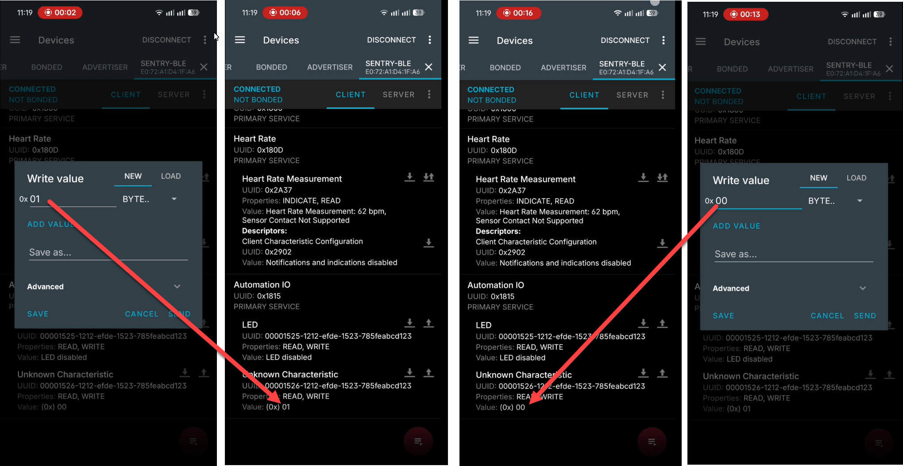
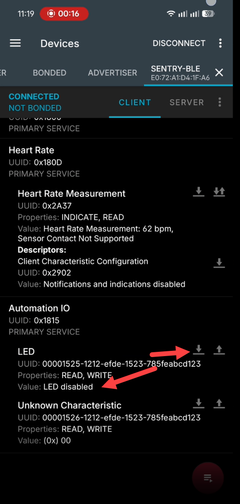
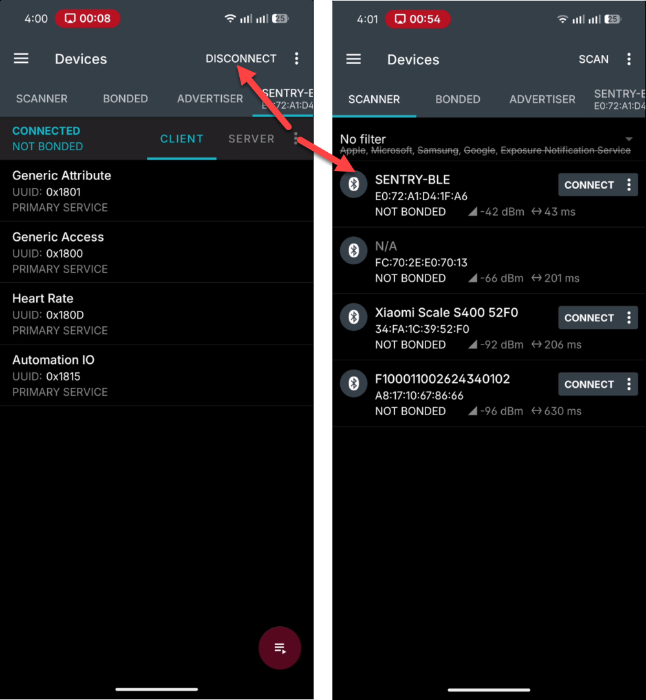

# Звіт ДЗ-14: Wi-Fi + BLE

## Середовище

| Параметр | Значення |
|---|---|
| Плата | ESP32-S3 DevKit |
| USB-UART міст | FTDI FT232R (VID `0x0403`, PID `0x6001`) |
| Прошивка, Частина A | `station_WiFi_merged.bin` (fw_4/git1) |
| Прошивка, Частина B | `Bluedroid_GATT_Server_merged.bin` (fw_4/git1) |
| ПК | Windows 11 Pro |
| Python / пакети | Python 3.12.4, pytest 9.1.1, pytest-asyncio 1.4.0, pyserial, bleak 3.0.2 |
| Wi-Fi мережа | хотспот зі смартфона, 2.4 GHz |
| BLE-клієнт | nRF Connect for Mobile `<версія>` на `<модель телефона>` (Android) |
| UART | 115200 8N1 |

## Невелике уточнення до виконаного ДЗ

На платі одночасно живе тільки одна прошивка, тому весь набір тестів за один `pytest -v` не пройде. Тести розділені маркерами і запускаються окремо під кожну прошивку:

- `station_WiFi` → `pytest -v -m wifi`
- `Bluedroid_GATT_Server` → `pytest -v -m ble`


## Зведення результатів

| Перевірка | Вимога PRD | Статус |
|---|---|---|
| test_scan_finds_networks | FR-W1 | PASS |
| test_connect_success | FR-W2, FR-W5 | PASS |
| test_disconnect | FR-W5, FR-W6 | XFAIL (BUG-001) |
| test_credentials_survive_reboot | FR-W4 | PASS |
| test_wrong_password | FR-W2 | PASS |
| test_short_password | FR-W3 | PASS |
| test_nonexistent_ssid | FR-W2, FR-C1 | PASS |
| B1.1 Scan | FR-A1 | PASS |
| B1.2 Connect + discovery | FR-A3, FR-G1, FR-G3 | див. BUG-002 |
| B1.3 Heart Rate | FR-G1, FR-G2 | PASS |
| B1.4 HR spike | FR-C3 | PASS |
| B1.5 LED через BLE | FR-G4 | PASS |
| B1.6 RELAY через BLE | FR-G4 | PASS |
| B1.7 Read після write | FR-G5 | PASS |
| B1.8 Конфлікт каналів | FR-G5 | PASS |
| B1.9 Reconnect | FR-A2, FR-A3 | PASS |
| test_ble_led_dual_channel | FR-G4 | PASS |

# Частина A

## Прогін Wi-Fi-тестів

Для запуску Wi-Fi-тестів використовувалась прошивка `station_WiFi`.

Перед запуском тестів потрібно задати змінні середовища. Варіант для Git Bash:

```bash
export ESP32_VID=0x403
export ESP32_PID=0x6001
export ESP32_SERIAL="<serial-number>"
export WIFI_SSID="<test-network-ssid>"
export WIFI_PASSWORD="<test-network-password>"
export WIFI_WRONG_PASSWORD="wrong-password-14"
export WIFI_SHORT_PASSWORD="short"
export WIFI_NONEXISTENT_SSID="__RANDOM_WRONG_SSID__"
```

Обов'язкові лише `WIFI_SSID` і `WIFI_PASSWORD`. Решта змінних мають значення за замовчуванням.

Паролі та реальні credentials не зберігаються в репозиторії: вони задаються лише змінними середовища.

Команда запуску:

```bash
pytest -v -m wifi
```

Результат прогону:

```text
$ pytest -v -m wifi
==================================================================== test session starts =====================================================================
platform win32 -- Python 3.12.4, pytest-9.1.1, pluggy-1.6.0 -- C:\Users\anton.yeryomin_qates\AppData\Local\Programs\Python\Python312\python.exe
cachedir: .pytest_cache
rootdir: D:\QA\AI\Goose_main\emb\dz14
configfile: pytest.ini
testpaths: tests
plugins: anyio-4.14.2, asyncio-1.4.0
asyncio: mode=Mode.AUTO, debug=False, asyncio_default_fixture_loop_scope=None, asyncio_default_test_loop_scope=function
collected 8 items / 1 deselected / 7 selected                                                                                                                 

tests/wifi/test_wifi_negative.py::test_wrong_password PASSED                                                                                            [ 14%]
tests/wifi/test_wifi_negative.py::test_short_password PASSED                                                                                            [ 28%]
tests/wifi/test_wifi_negative.py::test_nonexistent_ssid PASSED                                                                                          [ 42%]
tests/wifi/test_wifi_positive.py::test_scan_finds_networks PASSED                                                                                       [ 57%]
tests/wifi/test_wifi_positive.py::test_connect_success PASSED                                                                                           [ 71%]
tests/wifi/test_wifi_positive.py::test_disconnect XFAIL (BUG-001: after disconnect, status reports WiFi: connected with empty SSID and IP 0.0.0.0)      [ 85%]
tests/wifi/test_wifi_positive.py::test_credentials_survive_reboot PASSED                                                                                [100%]

=================================================== 6 passed, 1 deselected, 1 xfailed in 221.37s (0:03:41) ===================================================
```

---

## BUG-001

### Опис

Команда `status` після виконання `disconnect` повертає некоректний стан Wi-Fi.

| Поле | Значення |
|---|---|
| Порушена вимога | **FR-W5** (якщо не підключено — повідомлення, що не підключено) |
| Severity | Major: стан, про який звітує пристрій, суперечить фактичному |
| Priority | High |
| Environment | ESP32-S3 DevKit, `station_WiFi_merged.bin`, UART 115200 8N1 |
| Автотест | `tests/wifi/test_wifi_positive.py::test_disconnect` → XFAIL |

### Передумови

1. ESP32 прошита прошивкою `station_WiFi`.
2. ESP32 підключена до тестової Wi-Fi мережі.
3. UART monitor працює на швидкості 115200 8N1.

### Кроки відтворення

1. Підключитися до Wi-Fi за допомогою команди `connect`.
2. Виконати команду:

   ```text
   disconnect
   ```

3. Дочекатися повідомлення про відключення.
4. Виконати команду:

   ```text
   status
   ```

5. Перевірити отриманий стан Wi-Fi.

### Фактичний результат

Після повідомлення:

```text
I (...) wifi station: disconnected
```

команда `status` повертає:

```text
WiFi: connected
SSID:
IP: 0.0.0.0
RSSI: 0 dBm
```

Тобто після успішного `disconnect` пристрій повідомляє, що він усе ще підключений.

### Очікуваний результат

Після виконання `disconnect` команда `status` повинна повертати відключений стан, наприклад:

```text
WiFi: disconnected
```

SSID повинен бути порожнім або відсутнім, IP — неактивним, а RSSI — таким, що не свідчить про активне підключення.

### Доказ

Рядок із прогону pytest:

```text
tests/wifi/test_wifi_positive.py::test_disconnect XFAIL (BUG-001: after disconnect, status reports WiFi: connected with empty SSID and IP 0.0.0.0)
```
Фрагмент UART-логу відсутній через вимогу по ДЗ "міні багрепорт". Він ітак вийшов детальний.
---

# Частина B

Тестування виконувалося після прошивання:

```text
Bluedroid_GATT_Server_merged.bin
```

Ручні перевірки виконувалися через **nRF Connect for Mobile**. Одночасно відкритий UART monitor на швидкості 115200 8N1 використовувався як другий канал спостереження.

## 1. Scan

### Що перевірялось

У nRF Connect знайти пристрій `SENTRY-BLE` та зафіксувати RSSI.

### Очікуваний результат

Пристрій `SENTRY-BLE` видно у списку доступних BLE-пристроїв, RSSI відображається.

Посилання на PRD: **FR-A1**.

### Фактичний результат

Пристрій `SENTRY-BLE` знайдено. Зафіксований RSSI: **−50 dBm**.

### Доказ



**Статус: PASS**

---

## 2. Connect + discovery

### Що перевірялось

Підключення до `SENTRY-BLE` та discovery GATT-сервісів:

- Heart Rate Service `0x180D`;
- Automation IO Service `0x1815`;
- LED characteristic;
- RELAY characteristic;
- повідомлення про підключення у UART-лозі.

Посилання на PRD: **FR-A3, FR-G1, FR-G3**.

### Очікуваний результат

У сервісі `0x180D` присутня характеристика Heart Rate `0x2A37`.

У сервісі `0x1815` присутні:

```text
LED:
00001525-1212-efde-1523-785feabcd123

RELAY:
00001526-1212-efde-1523-785feabcd123
```

У UART-лозі з'являється повідомлення на кшталт:

```text
Connected, conn_id ..., remote <MAC>
```

### Фактичний результат

- підключення до `SENTRY-BLE` виконано;
- Heart Rate Service знайдено;
- Automation IO Service знайдено;
- у UART-лозі присутнє повідомлення `Connected`;
- RELAY characteristic у nRF Connect відображається як **unknown Characteristic**.

### UART-доказ

```text
I (1241797) GATTS_DEMO: Connected, conn_id 0, remote 6d:17:64:b7:69:bf
I (1241897) GATTS_DEMO: Packet length update, status 0, rx 27, tx 251
I (1242217) GATTS_DEMO: Connection params update, status 0, conn_int 24, latency 0, timeout 400
```

### Статус

**BUG-002** — RELAY characteristic відображається як unknown Characteristic.



---

## 3. Heart Rate

### Що перевірялось

Підписка на indications характеристики `0x2A37` та отримання значень частоти серцевих скорочень.

Посилання на PRD: **FR-G1, FR-G2**.

### Очікуваний результат

Значення оновлюються приблизно щосекунди та знаходяться в діапазоні **60–80 bpm**.

### Фактичний результат

Отримані значення знаходяться в очікуваному діапазоні:

```text
60, 72, 76, 70, 77, 72, 61 bpm
```

### UART-доказ

```text
I (1233527) GATTS_DEMO: Heart Rate updated to 60
I (1234527) GATTS_DEMO: Heart Rate updated to 72
I (1235527) GATTS_DEMO: Heart Rate updated to 76
I (1236527) GATTS_DEMO: Heart Rate updated to 70
I (1237527) GATTS_DEMO: Heart Rate updated to 77
I (1238527) GATTS_DEMO: Heart Rate updated to 72
I (1239527) GATTS_DEMO: Heart Rate updated to 61
```



**Статус: PASS**

---

## 4. HR spike

### Що перевірялось

У UART-терміналі виконати команду:

```text
hr spike
```

Альтернативний спосіб — натиснути кнопку K1.

Посилання на PRD: **FR-C3**.

### Очікуваний результат

Наступні значення Heart Rate повинні бути приблизно **190–199 bpm** протягом п'яти вимірювань.

### Фактичний результат

Отримані значення:

```text
190, 192, 191, 195, 198 bpm
```

### UART-доказ

```text
I (2542517) GATTS_DEMO: heart rate spike injected (5 ticks)
W (2542527) GATTS_DEMO: Heart Rate SPIKE injected: 190
W (2543527) GATTS_DEMO: Heart Rate SPIKE injected: 192
W (2544527) GATTS_DEMO: Heart Rate SPIKE injected: 191
W (2545527) GATTS_DEMO: Heart Rate SPIKE injected: 195
W (2546527) GATTS_DEMO: Heart Rate SPIKE injected: 198
```

**Статус: PASS**

---

## 5. LED через BLE

### Що перевірялось

У LED characteristic виконати:

- write `01`;
- write `00`.

Посилання на PRD: **FR-G4**.

### Очікуваний результат

- після write `01` LED вмикається, у UART з'являється `LED ON!`;
- після write `00` LED вимикається, у UART з'являється `LED OFF!`.

### Фактичний результат

LED коректно реагує на BLE-команди: загоряється коли write `01`, і вимикається коли write `00`

### UART-доказ

```text
I (3005377) GATTS_DEMO: Characteristic write, value len 1, value
I (3005377) GATTS_DEMO: 01
I (3005377) GATTS_DEMO: LED ON!
```

```text
I (3104507) GATTS_DEMO: Characteristic write, value len 1, value
I (3104507) GATTS_DEMO: 00
I (3104507) GATTS_DEMO: LED OFF!
```



**Статус: PASS**

---

## 6. RELAY через BLE

### Що перевірялось

У RELAY characteristic виконати write:

- `01` — увімкнення реле;
- `00` — вимкнення реле.

Посилання на PRD: **FR-G4**.

### Очікуваний результат

Реле змінює фізичний стан, а в UART з'являються:

```text
RELAY ON!
RELAY OFF!
```

### Фактичний результат

Команди виконуються, при `01` чутно характерне клацання, при `00` також чутне клацання трохи інакшого звучання.
У UART зафіксовані повідомлення:

```text
I (4454137) GATTS_DEMO: Characteristic write, value len 1, value
I (4454137) GATTS_DEMO: 01
I (4454137) GATTS_DEMO: RELAY ON!
```

```text
I (4466107) GATTS_DEMO: Characteristic write, value len 1, value
I (4466107) GATTS_DEMO: 00
I (4466107) GATTS_DEMO: RELAY OFF!
```

**Статус: PASS для фактичної реакції на write.**

Примітка: проблема discovery RELAY characteristic описана окремо як **BUG-002**.

---

## 7. Read після write

### Що перевірялось

Після write `01` виконати read відповідної LED або RELAY characteristic. Потім повторити для write `00`.

Посилання на PRD: **FR-G5**.

### Очікуваний результат

- після write `01` read повертає `01`;
- після write `00` read повертає `00`.

### Фактичний результат

Значення після write коректно читаються через nRF Connect.





UART-лог, LED ON/OFF:

```text
I (715397) GATTS_DEMO: Characteristic write, value len 1, value
I (715397) GATTS_DEMO: 01
I (715397) GATTS_DEMO: LED ON!
I (715527) GATTS_DEMO: Heart Rate updated to 65
I (715527) GATTS_DEMO: Attribute value set, status 0
I (716527) GATTS_DEMO: Heart Rate updated to 66
I (716527) GATTS_DEMO: Attribute value set, status 0
I (717527) GATTS_DEMO: Heart Rate updated to 65
I (717527) GATTS_DEMO: Attribute value set, status 0
I (718527) GATTS_DEMO: Heart Rate updated to 80
I (718527) GATTS_DEMO: Attribute value set, status 0
I (719527) GATTS_DEMO: Heart Rate updated to 67
I (719527) GATTS_DEMO: Attribute value set, status 0
I (719837) GATTS_DEMO: Characteristic write, value len 1, value
I (719837) GATTS_DEMO: 00
I (719837) GATTS_DEMO: LED OFF!
```
UART-лог, RELAY ON/OFF:

```text
I (872837) GATTS_DEMO: Characteristic write, value len 1, value
I (872837) GATTS_DEMO: 01
I (872837) GATTS_DEMO: RELAY ON!
I (873527) GATTS_DEMO: Heart Rate updated to 61
I (873527) GATTS_DEMO: Attribute value set, status 0
I (874527) GATTS_DEMO: Heart Rate updated to 69
I (874527) GATTS_DEMO: Attribute value set, status 0
I (875527) GATTS_DEMO: Heart Rate updated to 75
I (875527) GATTS_DEMO: Attribute value set, status 0
I (876497) GATTS_DEMO: Characteristic write, value len 1, value
I (876497) GATTS_DEMO: 00
I (876497) GATTS_DEMO: RELAY OFF!
```

**Статус: PASS**

---

## 8. Конфлікт каналів керування

### Що перевірялось

1. Увімкнути LED через BLE write `01`.
2. Вимкнути LED іншим каналом — кнопкою K2 або UART-командою `led off`.
3. Прочитати LED characteristic через BLE.

Посилання на PRD: **FR-G5**.

### Очікуваний результат

Після вимкнення LED іншим каналом BLE read повинен повернути:

```text
00
```

### Фактичний результат

Після BLE write `01` LED було вимкнено локальним каналом через K2. Подальше читання через BLE повернуло актуальний стан `00`.

### UART-доказ

```text
I (6139267) GATTS_DEMO: Characteristic write, value len 1, value
I (6139267) GATTS_DEMO: 01
I (6139267) GATTS_DEMO: LED ON!
I (6144477) GATTS_DEMO: button 2 pressed (GPIO40)
I (6144477) GATTS_DEMO: [K2] LED toggle (local)
I (6144477) GATTS_DEMO: LED OFF!
```



**Статус: PASS**

---

## 9. Reconnect

### Що перевірялось

Розірвати BLE-з'єднання через nRF Connect або UART-команду `disconnect`, після чого:

1. перевірити повідомлення `Disconnected`;
2. перевірити повернення пристрою в advertising;
3. повторно знайти та підключити пристрій.

Посилання на PRD: **FR-A2, FR-A3**.

### Очікуваний результат

У UART з'являються:

```text
Disconnected
Advertising start successfully
```

Після цього `SENTRY-BLE` знову видно у scan, а повторне підключення працює.

### Фактичний результат

Відключення та повторне підключення виконуються успішно.

### UART-доказ відключення

```text
I (90207) GATTS_DEMO: dropping BLE connection
W (90207) BT_HCI: hci cmd send: disconnect: hdl 0x1, rsn:0x13
W (90227) BT_HCI: hcif disc complete: hdl 0x1, rsn 0x16 dev_find 1
I (90227) GATTS_DEMO: Disconnected, remote 78:83:b0:3d:29:ed, reason 0x16
I (90237) GATTS_DEMO: Advertising start successfully
```

### UART-доказ повторного підключення

```text
I (347837) GATTS_DEMO: Connected, conn_id 0, remote 78:83:b0:3d:29:ed
I (347937) GATTS_DEMO: Packet length update, status 0, rx 27, tx 251
I (348237) GATTS_DEMO: Connection params update, status 0, conn_int 24, latency 0, timeout 400
I (348457) GATTS_DEMO: Connection params update, status 0, conn_int 6, latency 0, timeout 500
```



**Статус: PASS**

---

## BUG-002

### Опис

RELAY characteristic у сервісі Automation IO відображається як `unknown Characteristic` у nRF Connect.

| Поле | Значення |
|---|---|
| Порушена вимога | FR-G3 |
| Severity | Trivial: функціональність не порушена, read/write працюють |
| Priority | Low |
| Environment | ESP32-S3 DevKit, `Bluedroid_GATT_Server_merged.bin`, nRF Connect for Mobile `<версія>`, `<модель телефона>` |

### Передумови

1. ESP32 прошита `Bluedroid_GATT_Server`.
2. Пристрій `SENTRY-BLE` знайдено та підключено через nRF Connect.
3. Відкрито сервіс Automation IO `0x1815`.

### Кроки відтворення

1. Знайти `SENTRY-BLE` у nRF Connect.
2. Підключитися до пристрою.
3. Відкрити сервіс Automation IO `0x1815`.
4. Переглянути список характеристик.

### Очікуваний результат

Сервіс `0x1815` містить дві характеристики:

```text
LED:
00001525-1212-efde-1523-785feabcd123

RELAY:
00001526-1212-efde-1523-785feabcd123
```

### Фактичний результат

RELAY characteristic у nRF Connect відображається як:

```text
unknown Characteristic
```

Водночас запис значень `01` і `00` працює, а UART показує:

```text
RELAY ON!
RELAY OFF!
```

### Доказ


---

# Автоматизований BLE-тест

Файл тесту:

```text
tests/ble/test_ble_smoke.py
```

Тест:

```text
test_ble_led_dual_channel
```

Перевіряється сценарій:

1. `BleakScanner` знаходить `SENTRY-BLE`;
2. Bleak підключається до пристрою;
3. у LED characteristic виконується write `0x01`;
4. через UART підтверджується `LED ON!`;
5. у LED characteristic виконується write `0x00`;
6. через UART підтверджується `LED OFF!`;
7. BLE-з'єднання коректно закривається.

Команда запуску:

```bash
pytest -v -m ble
```

Результат:

```text
$ pytest -v -m ble
==================================================================== test session starts =====================================================================
platform win32 -- Python 3.12.4, pytest-9.1.1, pluggy-1.6.0 -- C:\Users\anton.yeryomin_qates\AppData\Local\Programs\Python\Python312\python.exe
cachedir: .pytest_cache
rootdir: D:\QA\AI\Goose_main\emb\dz14
configfile: pytest.ini
testpaths: tests
plugins: anyio-4.14.2, asyncio-1.4.0
asyncio: mode=Mode.AUTO, debug=False, asyncio_default_fixture_loop_scope=None, asyncio_default_test_loop_scope=function
collected 8 items / 7 deselected / 1 selected                                                                                                                 

tests/ble/test_ble_smoke.py::test_ble_led_dual_channel PASSED                                                                                           [100%]

============================================================== 1 passed, 7 deselected in 12.42s ==============================================================
```

**Статус: PASS**
